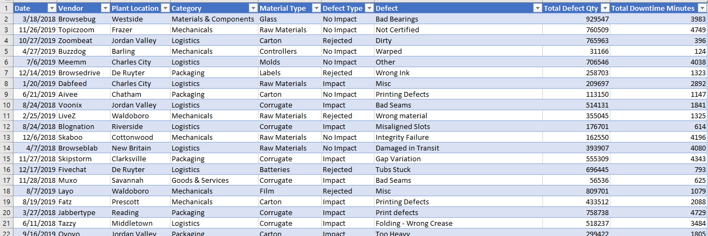
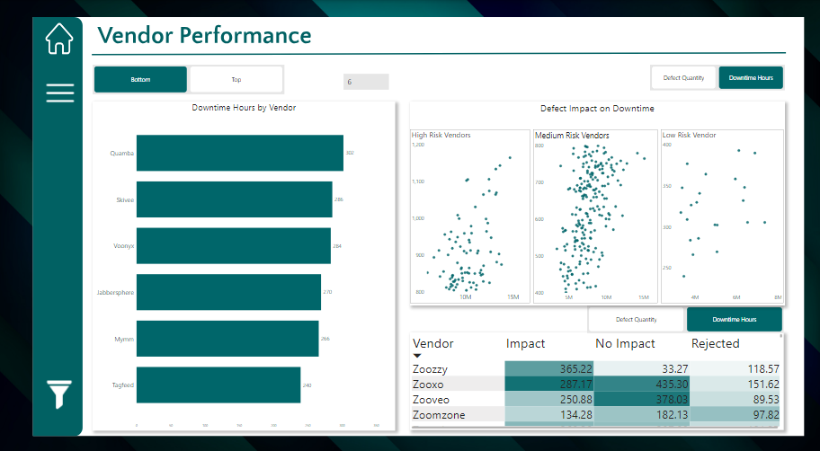
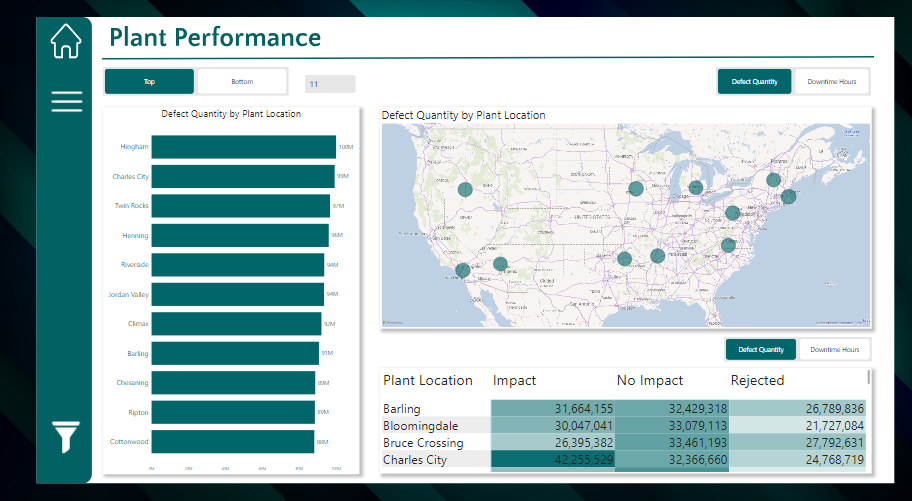

# Improving Supplier Quality Management Through Business Intelligence: A Strategic Approach for Manufacturers

## Introduction

For manufacturers, maintaining consistent raw material quality is critical to ensuring operational efficiency and reducing costs. However, many companies face challenges with supplier inconsistencies, leading to material defects that disrupt production, cause downtime, and increase expenses.

Managing supplier quality across multiple plants adds complexity. Without a centralized system to track and evaluate supplier performance, manufacturers often lack the visibility needed to identify trends, address performance issues, and improve overall supply chain efficiency. This lack of insight hinders data-driven decision-making, which is essential for enhancing supplier relationships and minimizing production risks.

To address these challenges, a strategic solution is required—one that consolidates supplier data, identifies problem areas, and provides actionable insights. This article explores how business intelligence can be used to optimize supplier quality management, enabling business leaders to make informed, data-driven decisions that positively impact both operations and profitability.

## Problem Statement

Enterprise Manufacturers Ltd. struggled with inconsistent supplier performance monitoring across different plants. The lack of visibility into supplier quality led to frequent production disruptions and inconsistent outputs. In their effort to centralize supplier performance data, management raised several key questions:

1. Which vendors/plants are responsible for the highest defect rates?
2. Which vendors/plants cause the most downtime? 
3. Are there specific material-vendor combinations that consistently present issues?
4. How does vendor performance vary across different plants?
5. Are there overlooked patterns or insights?
6. The company needed a clear, data-driven approach to visualize and answer these questions.

## Analysis Approach

The core business requirement was clear: 

*“Our company wants to start monitoring the performance and quality of goods sent to us. We don’t have a procurement system in place, and while we lack complete data, we need insights to monitor and improve this activity quickly.”*

With no existing procurement system and incomplete data, the goal was to deliver quick insights to improve supplier quality management. The analysis aimed to quantify the financial impact of poor quality and identify the key offenders—vendors, plants, and materials contributing to production inefficiencies.

Rather than presenting stakeholders with abstract metrics like defect counts or downtime minutes, the focus was on highlighting the financial cost of these issues. The goal was to clearly communicate how much money was being lost due to defects and identify the main sources of these problems.

## About the Dataset

The dataset used in the analysis includes the following fields:

- **Date:** When the defect was recorded.
- **Vendor:** The supplier providing the material.
- **Plant Location:** The geographic site of the plant using the material.
- **Category and Material Type:** Classifications of the material.
- **Defect Type:** The nature of the defect.
- **Total Defect Quantity:** The number of defective units recorded.
- **Total Downtime Minutes:** The downtime caused by defective materials.
  
## Methodology

To streamline reporting and improve performance, the data was modeled using a star schema. Key steps included:

## Segmenting the dataset into dimension tables: After analyzing the data, I identified attributes that could be divided into separate dimension tables. 
By breaking the data into smaller, manageable parts, I created dimension tables with unique identifiers for categories such as **Vendor, Plant Location, Material Type,** and **Defect Type**.

The objective was to develop a model optimized for efficient querying and insightful reporting. Here’s an overview of the steps I took:  

- **Duplicate the Query**: For each required dimension table, I duplicated the original query.
     
- **Rename the Tables**: Each query was renamed based on its role in the model, such as the Supplier Fact Table for central metrics like defect quantity and downtime minutes, and Dimension Tables for categories like **Vendor,** **Plant Location, Defect, Defect Type, Category,** and **Material Type.**

- **Select Relevant Columns**: For each table, I retained only the columns specific to that dimension. This step streamlined the dataset, ensuring each table contained only the essential information for analysis. Additionally, I created primary keys for each dimension by generating an index column.  

- **Building the Fact Table**: After establishing the dimension tables, I used Power BI's Merge feature to incorporate the keys back into the original dataset, resulting in a well-structured Fact Table.

**Creating a Date Table**: A crucial step in the process was building a dedicated Date Table. In data analysis, a Date Table is essential for creating time intelligence measures and applying time-related filters to reports. Using DAX (Data Analysis Expressions), I created an accurate Date Table that facilitated effective time series analysis, enabling the tracking of trends over time.

**Star Schema Data Model**: With the Dimension and Fact Tables prepared, the next step was to design the data model. I established relationships by linking the primary keys in the dimension tables to the foreign keys in the Fact Table. This resulted in a streamlined Star Schema Model. Organizing the data in this manner ensures efficient report generation without performance issues.

## **Analysis**:  
With the data prepared, the next challenge was designing a dashboard that provided actionable insights at a glance. I aimed to strike a balance between high-level summaries for executives and detailed breakdowns for procurement and production teams.  

The primary challenge was defining the right metrics based on the available data. I focused on three key metrics:  

- **Downtime**: Total hours lost due to defective materials.  
- **Defect Quantity**: The number of defective units received from suppliers.  
- **Downtime Cost**: The financial impact, assuming a loss of $10 for every hour of downtime.  

Initially, I questioned whether including defect quantity added value since there was no direct comparative data. However, I realized that there might be a potential correlation between downtime and defects, which proved correct. For example, some instances showed fewer defects but higher downtimes and vice versa.  

I also needed to determine whether to present downtime in minutes or hours. I opted for hours to align with the manufacturing industry’s standard of calculating costs on an hourly basis, ensuring consistency.  

Another question that arose was why downtime persisted even when defects seemed unrelated. I hypothesized that other factors, such as machine failures, power outages, staffing shortages, or delays in receiving materials, could contribute to the issue.

The homepage was designed to deliver a clean and professional interface with intuitive navigation tailored for stakeholders. A navigation bar was incorporated to allow users to seamlessly switch between the main sections of the report, each highlighting different aspects of supplier quality and performance. The layout takes inspiration from modern website designs, ensuring even non-technical decision-makers can easily access essential metrics.  

The emphasis was on utilizing graphic design to craft a visually appealing and user-friendly dashboard, making it simple for stakeholders to locate critical metrics at a glance.

## Overview Page

The top section of this page offers a summary of the key metrics:

- **Defects**: The total number of defects reported across all vendors, along with percentage changes compared to the previous month and year.
- **Downtime Hours**: The total downtime caused by defective materials, providing an immediate view of the operational impact.
- **Downtime Cost**: A crucial insight — by assigning a custom Downtime Cost per Hour (in this case, $10), we could directly calculate the financial impact of downtime, making the cost implications clear for the executive team.

A monthly trend chart was included, allowing users to toggle between defect quantities and downtime hours to track how these metrics evolved throughout the year. Another important section on the page was the *Worst Performers* section, where I provided a breakdown of defect data by vendor, material, plant, and defect type.

Additionally, I needed to display the ratio of impacted versus non-impacted defects and their distribution over the years.

## Vendor Performance

For the vendor analysis, the objective was to identify which suppliers were causing the most production issues. A **Top N Analysis** feature was incorporated into the dashboard, enabling users to filter and focus on a specific number of vendors. The analysis displayed either the top or bottom performers based on selected metrics, such as **Downtime Hours** or **Defect Quantity**, providing actionable insights into vendors excelling or underperforming.

Vendors were categorized into **high**, **medium**, and **low-risk** groups based on their defect impact and downtime performance, which allowed for a dynamic correlation analysis between these factors. Risk levels were determined using the following thresholds:
- **High-risk:** Downtime exceeds 800 hours.  
- **Medium-risk:** Downtime between 400 and 800 hours.  
- **Low-risk:** Downtime less than 400 hours.

This approach helped to clearly identify high-priority vendors for intervention and facilitated better decision-making regarding supplier performance and risk management.

## Plant Performance

To analyze plant performance, I introduced a **Top N Analysis** feature to identify the best and worst-performing plants based on key metrics. A **geographic map** was added to visualize the distribution of plants and their performance across regions, enhancing spatial awareness. Additionally, a **detailed table** broke down metrics such as **defect impact**, **no impact**, and **rejected defects**, helping to highlight the most problematic locations.

To provide deeper insights, **interactive tooltips** were included, offering quick access to specific metrics and information about each plant's location. This combination of visual and data-driven elements allowed for a comprehensive understanding of plant performance, enabling targeted improvements and decision-making.

## Material Performance

To analyze material performance, I provided a **detailed breakdown** of key metrics, including **downtime by material type, defect type, and category**. Critical defect categories, such as **Logistics** and **Mechanicals**, were visually highlighted to emphasize their importance. 

The analysis revealed an **increasing trend in Mechanicals defects**, indicating potential issues with **equipment maintenance** or **process inefficiencies**. Similarly, the rising trend in **Logistics defects** pointed to the need for **supply chain optimization**. These insights enabled stakeholders to identify areas requiring immediate attention and implement targeted solutions for material performance improvement.

## Downtime Impact

This page highlights the **significant financial losses** caused by defective materials, providing a clear and potentially alarming view for management. The **top section** breaks down downtime costs per hour, pinpointing specific days with the highest expenses. Notably, **September** and **December** experienced the most significant spikes. A **bar chart on the right** visualizes monthly downtime costs, enabling quick identification of peak periods.

At the **bottom of the page**, users can explore **Vendor-Plant** and **Vendor-Material combinations** to determine top and bottom performers.

## Key Insights Summary 

**Rising Defects and Downtime**  
Defective materials resulted in a surge of **2.6 billion defect units** and **216,000 hours of downtime**, translating to a financial loss of **$2.16 million**. This trend highlights the direct link between defective materials and reduced production efficiency.

**Financial Impact**  
The analysis revealed a strong **correlation between downtime and financial losses**. At an estimated **$10 per hour of downtime**, the company faced over **$2 million in costs**, with notable peaks in **September** and **December** due to severe disruptions. These insights emphasize the impact of supplier quality issues on the company’s bottom line.  

**Worst-Performing Vendors**  
Certain suppliers were flagged as **high-risk** due to their repeated contributions to defects and downtime. Vendors such as **Avamm**, **Meejo**, and **Yombu** emerged as top offenders, producing the most defects and incurring significant downtime. These findings highlight the need for targeted supplier improvement strategies.

**Plant-Specific Challenges**  
Several plants were identified as hotspots for defect-related downtime. **Hingham**, **Charles City**, and **Twin Rocks** reported defect quantities nearing **100 million units each**, indicating areas requiring immediate attention and process optimization.### Key Insights  

**Defect Categories**  
Recurring issues like **Bad Seams** emerged as the most frequent defect type, requiring focused intervention from both **suppliers** and **internal quality control teams** to mitigate their impact.

**Material Performance**  
**Raw materials** were identified as the most problematic, causing substantial downtime. Rising trends in **mechanical** and **logistics defects** point to the need for improvements in **process efficiency** and **supply chain management**.

**Vendor-Material and Vendor-Plant Combinations**  
These insights highlight critical areas for targeted action to enhance supplier and material performance. The analysis delved into specific **vendor-material** and **vendor-plant combinations** to pinpoint underperformers. For instance, the vendor **Abata**, when supplying raw materials, was a significant contributor to production issues, with:
- **3 million defects**  
- **249 downtime hours**  
- An estimated loss of **$2,500 in productivity**  

## **Recommendations**  

1. **Centralize Data and Automate Reporting:** Establishing a centralized data management system is crucial for monitoring and assessing supplier performance across various plants. Automation of data collection and reporting processes will improve visibility, minimize manual workload, and maintain consistency across operations.  

2. **Prioritize Financial Impact:** Instead of solely tracking defect counts and downtime, manufacturers should highlight the financial consequences of production delays. This approach helps business leaders understand the cost implications of supplier quality issues, promoting quicker and more informed decision-making.  

3. **Develop a Continuous Improvement Program:** Using insights from supplier performance data, manufacturers should implement a program aimed at continuous improvement. This initiative should focus on reducing downtime, enhancing material quality, and resolving recurring defects, ultimately increasing supplier accountability and supply chain efficiency.  

4. **Adopt Advanced Analytics:** To elevate supplier quality management, manufacturers should incorporate advanced analytics and predictive modeling. These tools enable early detection of patterns and trends, allowing businesses to address potential issues proactively before they escalate into costly disruptions or material losses.

## **Conclusion**  

Business intelligence tools have the potential to transform supplier quality management by converting raw data into meaningful, actionable insights. For Enterprise Manufacturers Ltd., adopting a BI-driven approach uncovered trends, inefficiencies, and risks that might have otherwise been overlooked. By quantifying the financial impact of defective materials, the company successfully identified and addressed the underlying causes of production inefficiencies.  

Centralizing procurement and performance data with Power BI equips the management team to make smarter decisions about vendor performance, plant operations, and material selection. This analysis not only pinpointed critical performance gaps but also laid the foundation for sustainable process improvements. 

Interactive Power BI Report
Click [HERE](https://drive.google.com/file/d/1bQbAJy1X_ncNC_sabEWH1fc2_JJFUD2L/view?usp=drive_link) to view interactive report
